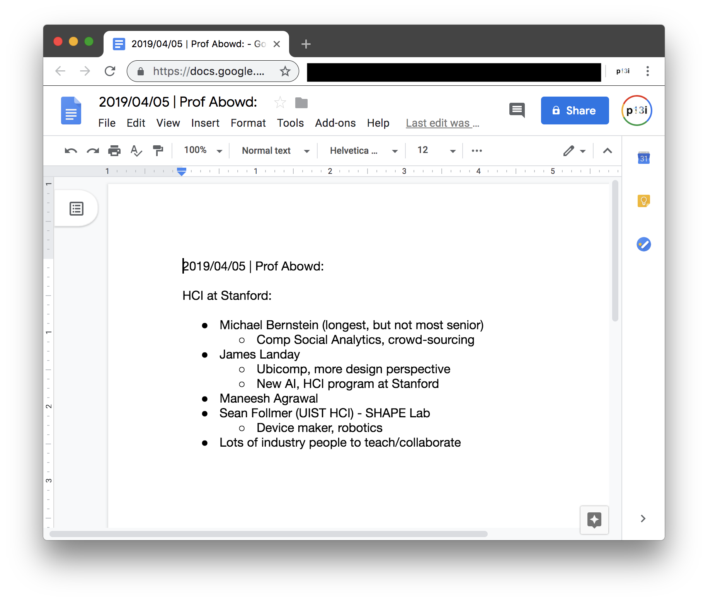

# remembrance-agent
Java package for Remembrance Agents! Based on Rhodes/Starner

[](https://travis-ci.org/glass-notes/remembrance-agent)


## Commands

### Building

```bash
VERSION="1.2.1" ./gradlew build
```

### Installing as Launch Daemon (macOS)

```bash
sudo VERSION="1.2.1" bash ./bin/install
```

Now you can run the following from anywhere:
```bash
VERSION="1.2.1" ra
```

### Running (cross platform)

Adapt the file `./bin/ra` for your platform.

## Screenshots

### RA client with menu open


### RA client with suggestion


### Chrome opened suggestion



## Developing

### Versioning

Increment the version numbers in this README.

---

Pramod Kotipalli  
@p13i  
http://p13i.io
