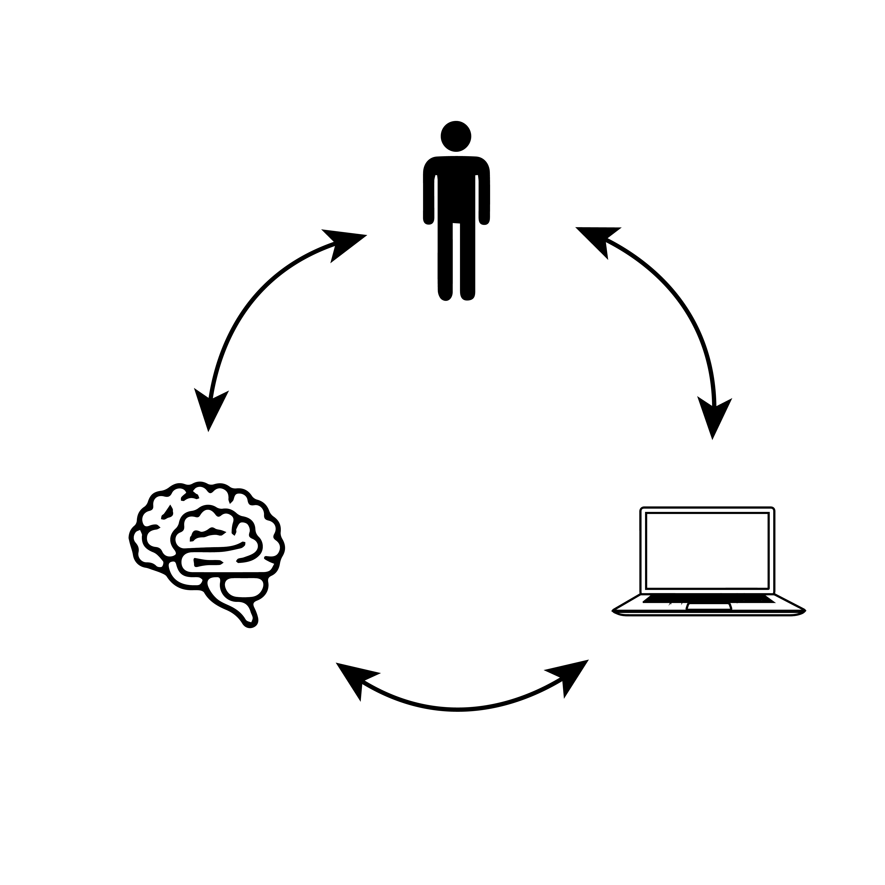
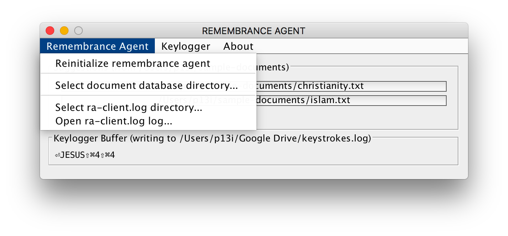
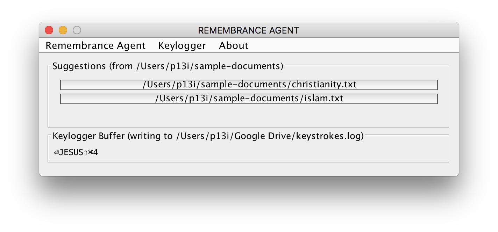
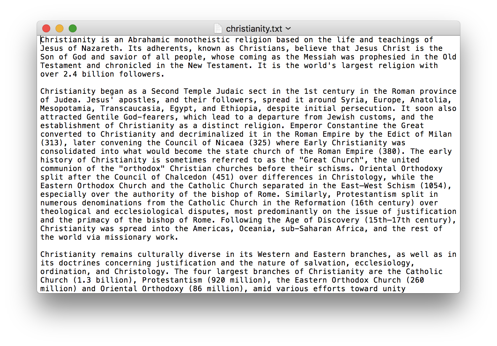

# remembrance-agent
Java package for Remembrance Agents! Based on Rhodes/Starner

[](https://travis-ci.org/glass-notes/remembrance-agent)



## Commands

### Building

```bash
VERSION="1.1" ./gradlew build
```

### Installing as Launch Daemon (macOS)

```bash
sudo VERSION="1.1" bash ./bin/install
```

Now you can run the following from anywhere:
```bash
VERSION="1.1" ra
```

### Running (cross platform)

```bash
./gradlew build
java -jar ./build/libs/remembrance-agent-v1.0-all.jar
```

## Screenshots

### RA client with menu open



### RA client with suggestion



### TextEdit opened suggestion



## Developing

### Versioning

Increment the version numbers in this README.

---

Pramod Kotipalli  
@p13i  
http://p13i.io
